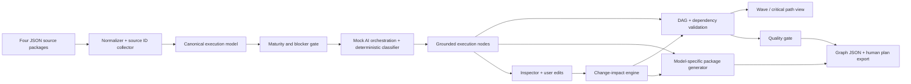

# Architecture

The browser prototype is intentionally dependency-free and runs in mock mode. `app.js` keeps the imported package in `sourcePackage`, normalizes IDs into `sourceIds`, derives an execution graph, validates and edits dependencies, computes change impact, generates a model-specific execution package for every node, and exports both graph JSON and a human-readable plan with provenance. No network call, account login, paid model, recruitment action, or challenge submission is performed by the prototype.

The production handoff would replace the normalizer input adapter with the four official challenge packages, preserve the same graph schema, and add a backend for persistent package storage and authenticated export. The current mock keeps the behavior reviewable offline while still exercising the required user flow.
